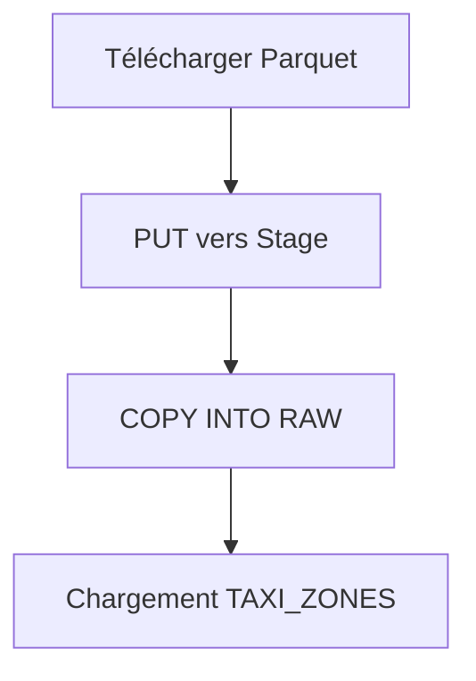

# Flux de données — NYC Taxi Pipeline


## Étape 1 : Ingestion (Python)

**Script** : `ingestion/download_tlc.py`



- Téléchargement depuis le CDN TLC NYC
- Upload vers le stage Snowflake interne
- Chargement avec COPY INTO (format Parquet)

## Étape 2 : Transformation (DBT)

**Modèles** : `nyc_taxi_dbt/models/`

| Modèle | Matériau | Source | Lignes |
|--------|----------|--------|--------|
| stg_yellow_trips | Vue | RAW.YELLOW_TRIPS | 38.4M |
| kpi_monthly | Table | stg_yellow_trips | 13 |
| kpi_hourly | Table | stg_yellow_trips | 24 |
| kpi_zones | Table | stg_yellow_trips + TAXI_ZONES | 20 |
| kpi_payment | Table | stg_yellow_trips | 5 |

## Étape 3 : Monitoring

**Scripts** : `monitoring/` et `sql/`

- Source freshness (dbt) : Vérification 30/90 jours
- ACCOUNT_USAGE : Requêtes lentes, stockage
- GitHub Actions : Pipeline CI/CD

## Étape 4 : Visualisation

**Dashboard** : `dashboard/app.py`

- KPIs en temps réel depuis Snowflake
- Cache intelligent (TTL 1h)
- 4 visualisations : mensuel, horaire, zones, paiement

## Orchestration CI/CD

**Pipeline** : `.github/workflows/dbt_ci.yml`

```
push → dbt compile → dbt test → dbt run
```

- Temps d'exécution : ~20 secondes
- Tests : `not_null` sur 3 colonnes
- Déploiement automatique en main